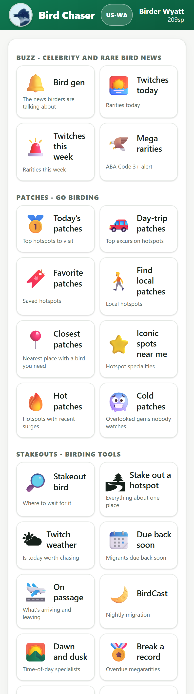
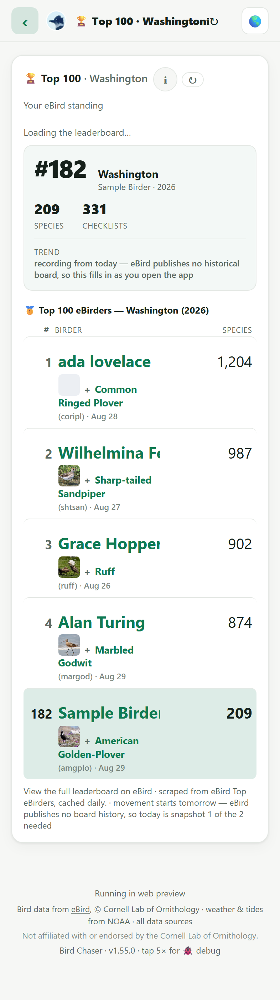
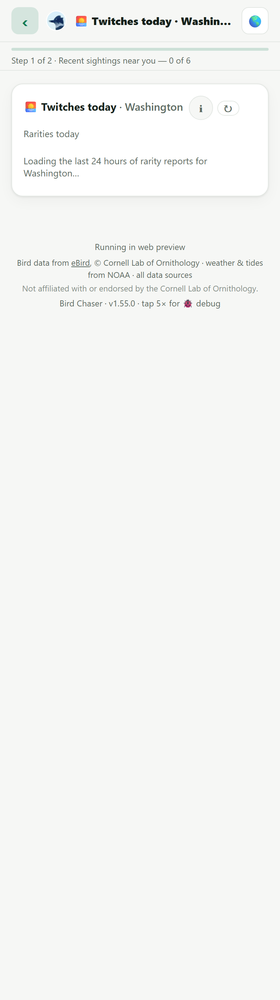
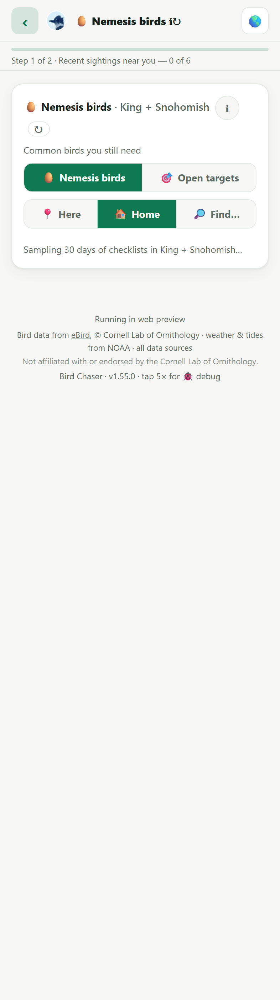
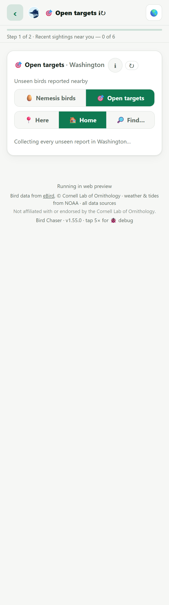

# UI mockups — 393px

Generated 2026-08-30 13:54 UTC by `node assets/mockups.js`.

⚠️ Laid out inside an iframe of an exact CSS width. Chrome's
`--window-size` does **not** set the layout viewport on Windows — it
lays out at 500px and crops the PNG, which looks exactly like a real
right-edge clip. Do not replace this with `--screenshot`.

**393px is the binding width** (iPhone 14/15 Pro), not 402 (16 Pro).

### Contents menu

### Top 100 rows

### Twitches today — a rarity card with comments

### Nemesis birds

### Open targets

