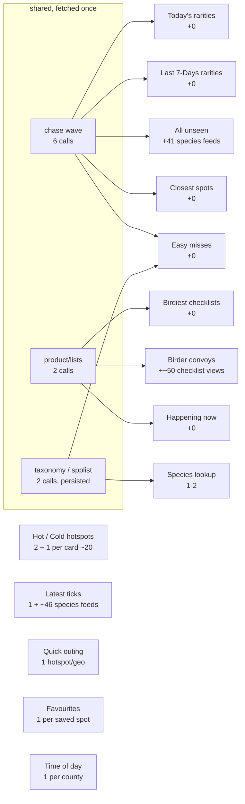

# eBird API calls — what each section spends, and why loading is slow

Every number here is either read out of the code or measured. Where a count
depends on the day's data (how many birds you still need, how many rarities
turned up) it is written as a formula with a typical Washington value beside it.

Two counties (King, Snohomish) plus one geo circle — that is the Washington
profile the examples use.

---

## 1. The endpoints, grouped by type

| # | Endpoint | What it answers | Called by |
|---|---|---|---|
| 1 | `data/obs/{region}/recent` | everything reported lately in a county/state — **one row per species** | chase wave (per county), Latest ticks code index |
| 2 | `data/obs/{region}/recent/notable` | just the flagged rarities | chase wave (per county) |
| 3 | `data/obs/geo/recent` | same, as a circle around home (**capped at 50 km**) | chase wave |
| 4 | `data/obs/geo/recent/notable` | rarities in that circle | chase wave |
| 5 | `data/obs/{region}/recent/{species}` | **every** recent report of ONE bird | chase phase 2, Latest ticks, rarity cascade |
| 6 | `data/obs/{locId}/recent` | the species list for ONE hotspot | hotspot cards, favourites |
| 7 | `data/obs/{locId}/historic/{y}/{m}/{d}` | what was at a place on a past date | ABA history, GBIF-style baselines |
| 8 | `product/lists/{region}` | recent checklists for a county | Birdiest · Convoys · Happening now (**one shared cached promise**) |
| 9 | `product/checklist/view/{subId}` | one checklist in full — species, media, **comments** | convoy species, finder names, birdiest unseen, 🎯 evidence |
| 10 | `ref/hotspot/geo` | hotspots near a point (**capped at 50 km**) | Quick outing, region derivation |
| 11 | `ref/taxonomy/ebird` | code → name/family | species index, Easy misses, convoys |
| 12 | `product/spplist/{region}` | every species ever recorded in a region | species index |

Types 1–7 are **observation** feeds: they change hourly and are cached only for
the day. Types 10–12 are **reference** feeds: they barely change, and are
persisted (`ebRefGet`/`ebRefPut`).

### Measured, from the report of 2026-08-07

The Markdown report prints its own ledger. 310 calls, 0 rate-limited:

| Endpoint | Calls | Share |
|---|---:|---:|
| `product/checklist/view/{checklist}` | 206 | **66%** |
| `data/obs/{region}/recent/{species}` | 60 | 19% |
| `data/obs/{loc}/historic/*` | 27 | 9% |
| `product/lists/{region}/*` | 8 | 3% |
| `data/obs/{region}/recent` | 3 | 1% |
| `data/obs/{loc}/recent` | 3 | 1% |
| `product/lists/{region}` | 2 | 1% |
| `data/obs/{region}/recent/notable` | 1 | 0% |

**Two thirds of everything is one endpoint**, and it is the one that costs a
call *per checklist*. Anything that reduces `product/checklist/view` reduces
the bill more than everything else put together.

---

## 2. What each menu section spends



| Section | Calls on a first open | Why |
|---|---:|---|
| Chase wave (shared) | **6** | 2 counties × (recent + notable) + 2 geo |
| ↳ phase 2 | **~41** | one `recent/{species}` per bird you still need |
| Today's rarities | 0 | reads the wave |
| Last 7-Days rarities | 0 | reads the wave |
| Closest spots / Easy misses / All unseen | 0 | read the wave |
| 🎯 evidence (new) | 0 until opened, then **1 per row** | lazy — see below |
| Birdiest checklists | **2** | `product/lists` per county, then shared |
| Happening now | 0 | same cached promise |
| Birder convoys | **~50** | one `checklist/view` per checklist on the routes |
| Hot / Cold hotspots | **~20** | 2 scans + one `{locId}/recent` per card |
| Latest ticks | **~47** | 1 region index + one species feed per bird the top 100 added |
| Quick outing | **1** | one `ref/hotspot/geo` |
| Species lookup | **1–2** | spplist + one species feed |
| Favourites | 1 per saved spot | one `{locId}/recent` each |
| Time of day | 1 per county | |

---

## 3. Why the loaders are slow

### The ceiling is eBird's, and it is low

Measured directly against the API (`prototypes/ebird-ratelimit-*.py`), two
limits are stacked:

* **short term** — a bucket of ~10, refilling ~1/s
* **sustained** — ~29–30 successes per ~60–78 s, i.e. **~0.37 calls/second**

It is **per key, not per URL**: 60 distinct species feeds did slightly *worse*
than one URL repeated, so spreading a wave across endpoints buys nothing.

At 0.37/s, a 47-call section **cannot** finish in less than ~2 minutes. That is
not a client bug and no amount of re-pacing fixes it.

### So the dominant term is VOLUME, not pacing

| Section | Calls | Floor at eBird's own ceiling |
|---|---:|---:|
| Latest ticks | 47 | ~2min 7s |
| Birder convoys | ~52 | ~2min 20s |
| Chase wave (both phases) | 47 | ~2min 7s |
| Hot / Cold hotspots | ~22 | ~1min |

Open three of those in a session and it is **~7 minutes of paced fetching**,
because they all draw from one bucket on one key.

### The app is currently pacing below even that ceiling

```js
var FG_MAX_CONC = 1, FG_MIN_GAP_MS = 250;
var FG_BUCKET = 8, FG_REFILL_PER_S = 0.3;
```

`0.3/s` against a measured `0.37/s`, and a bucket of `8` against a measured
`~10`. The derivation in the source says why:

> **AND THE REPORT JOB SHARES THIS KEY.** At 1660 calls × 4 s it runs at 0.25/s
> for 111 minutes out of every 3 hours — 68% of the sustainable budget, 61% of
> the time. That leaves ~0.12/s for the phone.

**That is no longer true.** Every cron in `.github/workflows/` is commented out
— the scheduled report job does not run. The phone now has the whole key to
itself, and is still budgeting for a competitor that no longer exists.

This is worth ~25% on its own (0.3 → 0.37) and more on the burst (8 → 10). It
is not the big win, but it is nearly free.

### `FG_MAX_CONC = 1` makes every other concurrency constant decorative

```
LAST_NEW_FETCH_CONC = 4     CONVOY_FETCH_CONC = 4
CKL_EVID_CONC       = 3     LOC_SPECIES_CONC  = 3     SPECIES_BATCH = 2
```

All five queue behind a gate that admits **one** request at a time. They bound
how many *promises* exist, not how many requests are in flight. That is
deliberate — concurrency 2 was what made 429s arrive in pairs — but it means
tuning those numbers cannot make anything faster, and reading them as if it
could is a trap.

### And one 429 is very expensive

A refusal doubles the gap globally, empties the bucket, and pauses **every**
queued call for a 20 s cooldown. The device log behind the current design
showed one 429 costing ~100 s of wall clock and cascading into ~25 more.

---

## 4. Where the time actually goes — and what would fix it

Ranked by how much they would save:

1. **Persist `product/checklist/view` across launches.** It is 66% of the
   report's calls and a large share of the app's. A checklist is effectively
   immutable once filed, yet the app re-fetches it every session — `_ebCache`
   is in-memory and 30 minutes. A day-scoped (or permanent) IndexedDB cache
   would remove most of the convoy and evidence cost outright.

2. **Share the checklist cache between sections.** Convoys, Birdiest, finder
   names and the new 🎯 evidence all read the same endpoint for the same
   checklists on the same day, through four different code paths.

3. **Do not re-derive what a snapshot already knows.** The chase wave's phase 2
   already writes every unseen species' recent reports to a snapshot. Latest
   ticks then asks for many of the same species again through its own cache.

4. **Raise the pacing to the solo ceiling** now that nothing shares the key —
   bucket 8→10, refill 0.3→0.37. Small, safe, and immediate.

5. **Prefetch while the reader is reading.** The board paints from a leaderboard
   read in a second; the following two minutes are spent on rows nobody has
   scrolled to yet. Fetching in scroll order — or only what is on screen —
   would put the same information in front of the user far sooner.

See `BACKLOG.md` → **Optimise loading** for the tracked version of this.
