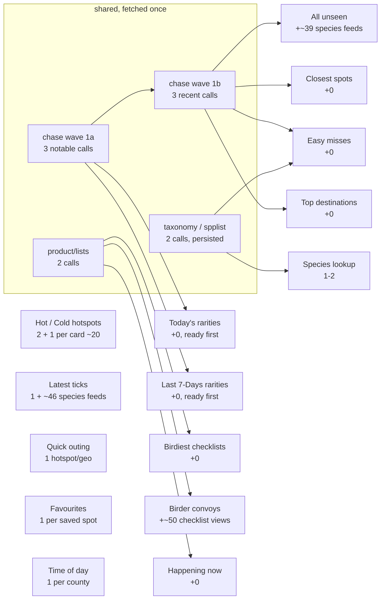

# eBird API calls — what each section spends, and why loading is slow

Every number here is either read out of the code or measured. Where a count
depends on the day's data (how many birds you still need, how many rarities
turned up) it is written as a formula with a typical Washington value beside it.

Two counties (King, Snohomish) plus one geo circle — that is the Washington
profile the examples use.

---

## 1. The endpoints, grouped by type

| # | Endpoint | What it answers | Called by |
|---|---|---|---|
| 1 | `data/obs/{region}/recent` | everything reported lately in a county/state — **one row per species** | chase wave (per county), Latest ticks code index |
| 2 | `data/obs/{region}/recent/notable` | just the flagged rarities | chase wave (per county) |
| 3 | `data/obs/geo/recent` | same, as a circle around home (**capped at 50 km**) | chase wave |
| 4 | `data/obs/geo/recent/notable` | rarities in that circle | chase wave |
| 5 | `data/obs/{region}/recent/{species}` | **every** recent report of ONE bird | chase phase 2, Latest ticks, rarity cascade |
| 6 | `data/obs/{locId}/recent` | the species list for ONE hotspot | hotspot cards, favourites |
| 7 | `data/obs/{locId}/historic/{y}/{m}/{d}` | what was at a place on a past date | ABA history, GBIF-style baselines |
| 8 | `product/lists/{region}` | recent checklists for a county | Birdiest · Convoys · Happening now (**one shared cached promise**) |
| 9 | `product/checklist/view/{subId}` | one checklist in full — species, media, **comments** | convoy species, finder names, birdiest unseen, 🎯 evidence |
| 10 | `ref/hotspot/geo` | hotspots near a point (**capped at 50 km**) | Quick outing, region derivation |
| 11 | `ref/taxonomy/ebird` | code → name/family | species index, Easy misses, convoys |
| 12 | `product/spplist/{region}` | every species ever recorded in a region | species index |

Types 1–7 are **observation** feeds: they change hourly and are cached only for
the day. Types 10–12 are **reference** feeds: they barely change, and are
persisted (`ebRefGet`/`ebRefPut`).

### Measured, from the report of 2026-08-07

The Markdown report prints its own ledger. 310 calls, 0 rate-limited:

| Endpoint | Calls | Share |
|---|---:|---:|
| `product/checklist/view/{checklist}` | 206 | **66%** |
| `data/obs/{region}/recent/{species}` | 60 | 19% |
| `data/obs/{loc}/historic/*` | 27 | 9% |
| `product/lists/{region}/*` | 8 | 3% |
| `data/obs/{region}/recent` | 3 | 1% |
| `data/obs/{loc}/recent` | 3 | 1% |
| `product/lists/{region}` | 2 | 1% |
| `data/obs/{region}/recent/notable` | 1 | 0% |

**Two thirds of everything is one endpoint**, and it is the one that costs a
call *per checklist*. Anything that reduces `product/checklist/view` reduces
the bill more than everything else put together.

---

## 2. What each menu section spends



| Section | Calls on a first open | Why |
|---|---:|---|
| Chase wave — group 1a (notable) | **3** | 2 counties + geo; completes both rarity sections on its own |
| ↳ group 1b (recent) | **3** | completes phase 1 |
| ↳ phase 2 | **~39** | one `recent/{species}` per bird you still need |
| Today's rarities | 0 | reads the wave — ready at group **1a** |
| Last 7-Days rarities | 0 | reads the wave — ready at group **1a** |
| Closest spots / Easy misses / All unseen | 0 | read the wave |
| 🎯 evidence | 0 | carried on the notable feed; painted at build time |
| Birdiest checklists | **2** | `product/lists` per county, then shared |
| Happening now | 0 | same cached promise |
| Birder convoys | **~50** | one `checklist/view` per checklist on the routes |
| Hot / Cold hotspots | **~20** | 2 scans + one `{locId}/recent` per card |
| Latest ticks | **~47** | 1 region index + one species feed per bird the top 100 added |
| Quick outing | **1** | one `ref/hotspot/geo` |
| Species lookup | **1–2** | spplist + one species feed |
| Favourites | 1 per saved spot | one `{locId}/recent` each |
| Time of day | 1 per county | |

A same-day snapshot replaces the whole first column with **0**. See
`QUERY-PLAN.md` §2.

---

## 3. Why the loaders are slow

### The ceiling is eBird's, and it is low

Measured directly against the API (`prototypes/ebird-ratelimit-*.py`), two
limits are stacked:

* **short term** — a bucket of ~10, refilling ~1/s
* **sustained** — ~29–30 successes per ~60–78 s, i.e. **~0.37 calls/second**

It is **per key, not per URL**: 60 distinct species feeds did slightly *worse*
than one URL repeated, so spreading a wave across endpoints buys nothing.

At 0.37/s, a 47-call section **cannot** finish in less than ~2 minutes. That is
not a client bug and no amount of re-pacing fixes it.

### So the dominant term is VOLUME, not pacing

| Section | Calls | Floor at eBird's own ceiling |
|---|---:|---:|
| Latest ticks | 47 | ~2min 7s |
| Birder convoys | ~52 | ~2min 20s |
| Chase wave (both phases) | 47 | ~2min 7s |
| Hot / Cold hotspots | ~22 | ~1min |

Open three of those in a session and it is **~7 minutes of paced fetching**,
because they all draw from one bucket on one key.

### The app now paces at the measured ceiling

```js
var FG_MAX_CONC = 1, FG_MIN_GAP_MS = 250;
var FG_BUCKET = 10, FG_REFILL_PER_S = 0.37;
var FG_WINDOW_MS = 60000, FG_WINDOW_MAX = 20;
```

This used to read `FG_BUCKET = 8, FG_REFILL_PER_S = 0.3`, budgeting for a
competitor that no longer exists:

> **AND THE REPORT JOB SHARES THIS KEY.** At 1660 calls × 4 s it runs at 0.25/s
> for 111 minutes out of every 3 hours — 68% of the sustainable budget, 61% of
> the time. That leaves ~0.12/s for the phone.

Every cron in `.github/workflows/` is commented out; the phone has the key to
itself. The constants were raised to the measured solo ceiling, and a **rolling
60-second window of 20 starts** was added alongside the token bucket — the
bucket alone let a burst through that the sustained limit then punished.

The debug line reports both, which is how you tell which one is binding:

```
done 1802ms · 46 calls · queue 0+0bg/1 · gap 250ms · tokens 7.7 · window 21/20
```

`tokens 7.7` with `window 21/20` means the bucket is full and the **window** is
what is holding the lane — the correct reading of a ~27 s stall.

### `FG_MAX_CONC = 1` makes every other concurrency constant decorative

```
LAST_NEW_FETCH_CONC = 4     CONVOY_FETCH_CONC = 4
CKL_EVID_CONC       = 3     LOC_SPECIES_CONC  = 3     SPECIES_BATCH = 2
```

All five queue behind a gate that admits **one** request at a time. They bound
how many *promises* exist, not how many requests are in flight. That is
deliberate — concurrency 2 was what made 429s arrive in pairs — but it means
tuning those numbers cannot make anything faster, and reading them as if it
could is a trap.

It also means **every call is serial**, so a section's wall-clock cost is just
its call count ÷ 0.37/s, and *anything extra you prefetch delays something
else.* See `QUERY-PLAN.md` §5 for what that rules out.

### And one 429 is very expensive

A refusal doubles the gap globally, empties the bucket, and pauses **every**
queued call for a 20 s cooldown. The device log behind the current design
showed one 429 costing ~100 s of wall clock and cascading into ~25 more.

---

## 4. Where the time actually goes — and what was done about it

Ranked by how much they saved. The first four have shipped.

1. ✅ **Persist `product/checklist/view` across launches.** It was 66% of the
   report's calls and a large share of the app's. A checklist is effectively
   immutable once filed, yet the app re-fetched it every session. Now a durable
   `bc_ckl:` cache with an **age-aware TTL** — 1 day while a checklist is still
   settling, 30 days once it carries media, 7 days if it never will
   (`checklistCacheTtl`).

2. ✅ **Share the checklist cache between sections.** Convoys, Birdiest, finder
   names and 🎯 evidence read one cache through one path.

   And the biggest part of this turned out not to need the endpoint at all:
   **the notable feed already carries `evidence` (P/A/V) on 400 of 400 live
   rows.** The media icons were being dropped at hand-off, not fetched. Three
   separate hand-offs have now been found dropping that field. `hasComments`,
   by contrast, is `false` on all 400 — do not trust it.

3. ✅ **Raise the pacing to the solo ceiling** — bucket 8→10, refill
   0.3→0.37, plus the 20-per-60 s window the bucket alone was missing.

4. ✅ **Serve the stored snapshot first.** A same-day snapshot is painted
   immediately and refreshed behind; within 30 minutes it *is* the answer and
   costs nothing. This is worth more than everything else here combined — but
   only if the write survives, which is why storage priority (§5) is now part
   of the design rather than an afterthought.

5. ✅ **Fetch the rarity feeds first.** In phase 1 a row is a `Rarity` if and
   only if a notable feed carried it, so the three notable feeds complete two
   whole sections on their own. They now run as their own group and those
   sections paint after 3 calls instead of 6. See `QUERY-PLAN.md` §3.

Still open:

6. **Do not re-derive what a snapshot already knows.** The chase wave's phase 2
   already writes every unseen species' recent reports to a snapshot. Latest
   ticks then asks for many of the same species again through its own cache —
   at a different `back=` window, which is what stops them sharing.

7. **Prefetch while the reader is reading.** The board paints from a leaderboard
   read in a second; the following two minutes are spent on rows nobody has
   scrolled to yet. Fetching in scroll order — or only what is on screen —
   would put the same information in front of the user far sooner.

---

## 5. Storage is part of the budget

iOS gives the origin roughly **5 MB** for everything. A write that fails is a
query plan that repeats itself — and a device log caught exactly that:

```
[warn] freed 2 cached checklists to make room
[warn] chase snapshot not saved: QuotaExceededError
```

141 seconds and 48 calls, discarded. Two things were wrong, and neither was the
retry count:

* `pruneChaseSnapshots()` ran **after** the write, so every attempt competed
  with yesterday's snapshots — the one thing in the store guaranteed to be
  worthless.
* eviction could only reach `bc_ckl:`. "Freed 2" was not stubbornness, it was
  an empty drawer, while the rest of the store sat untouched.

Priority is by **what it costs to fetch again**, and the rule that bounds it is
that nothing the network cannot hand back is ever evicted — not your watchlist,
not birds harvested from your own checklists, not the rank history accumulated
a day at a time, not which rarities you have already been shown.

---

## 6. What the API will not give you

Some things stay undone because the data is not there, not because nobody got
to them. Measured 2026-08-11 against King County, so the next person who has
the idea can read the answer instead of buying it again.

**Photos, video and audio cannot be shown in-app.** Every feed says media
*exists* and says what KIND, and nothing anywhere says WHICH:

| Field | Where | What it gives |
|---|---|---|
| `hasRichMedia` | notable / recent rows | a boolean |
| `evidence` | notable / recent rows | the letters `P` / `V` / `A` |
| `mediaCounts` | `product/checklist/view` obs entries | `{"P": 1}` — a count per type |

A Macaulay asset id appears in none of them. Probing a checklist known to hold
a photo returned zero `*[Aa]sset*` keys and zero `ML\d{6,}` tokens anywhere in
the payload, top level or per-observation. Without an id there is no
`.../asset/{id}/1200` to point an `` at, so embedding would need a second,
undocumented Macaulay endpoint — which is a dependency this project does not
take for a picture.

So a rarity's evidence sheet shows the note and the waypoint, NAMES what media
the checklist holds, and links out to the checklist that displays it. One tap,
and honest about which of those two things it is. (W52.)

The corollary worth remembering: `evidence` and `mediaCounts` are still worth
reading. They are free, they ride on feeds already being fetched, and knowing a
sighting has a photo is most of why you would open it.

---

## 7. Reading the in-app ledger

The debug panel attributes each call to whichever section was **open when it
completed**, not to the section that caused it. A shared wave appears charged
to whatever you were looking at:

```
26 live · 0 cached  🚶 Quick outing
22 live · 0 cached  🥇 Top destinations
  50 live calls total, 2 served from cache
```

That is one 47-call wave plus one hotspot call. The ledger measures **when**,
not **why**. (`2 served from cache` out of 50 is itself the signature of the
snapshot write failing.)

See `QUERY-PLAN.md` for the full per-section plan and `BACKLOG.md` →
**Optimise loading** for the tracked version of the open items.
