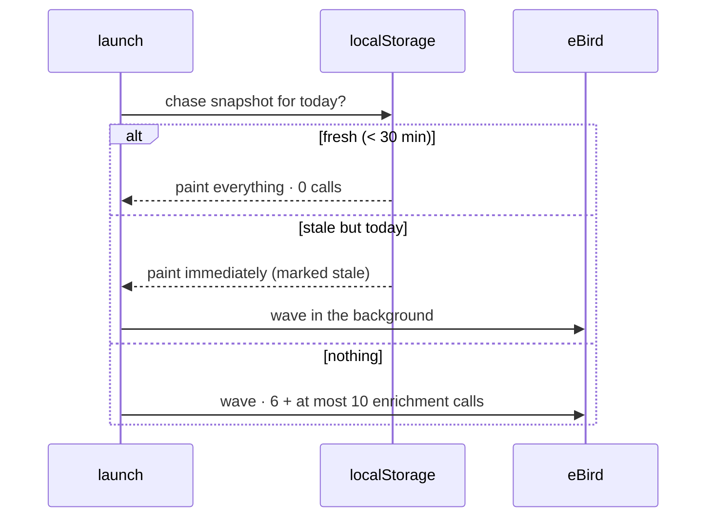
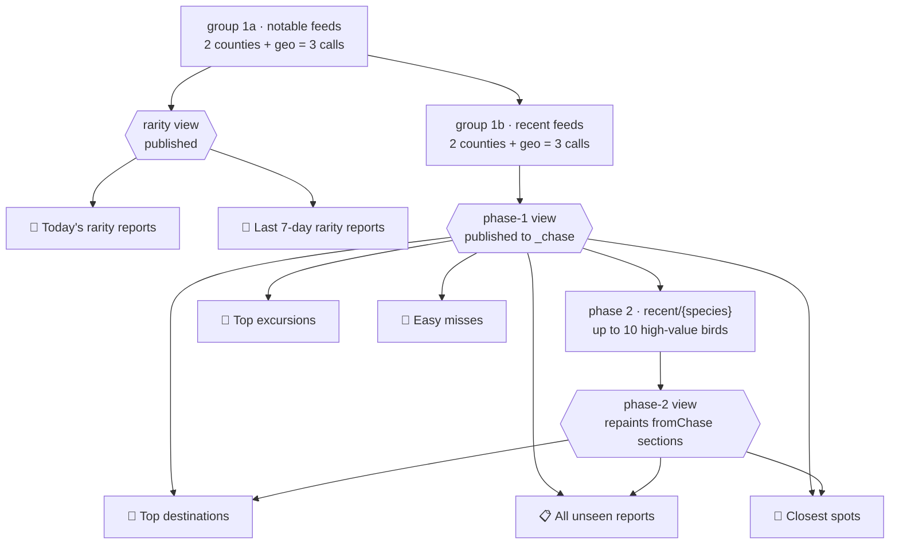

# Query plan — every section, what it asks for, and in what order

The app has **no runtime GitHub dependency**: every row on screen comes from a
call the phone makes itself. This file is the map of those calls — what each
screen needs, what it shares, what it can be served from cache, and which calls
have to happen *first*.

Companion to `API-CALLS.md`, which covers cost and pacing. This one covers
**order and dependency**.

Everything here is read out of the code or measured from a device log. Where a
number depends on the day it is written as a formula with a typical Washington
value (King + Snohomish + a 50 km circle) beside it.

---

## 1. The one fact that shapes everything

**There is one budget, and every section spends from it.**

Measured against the live API (`prototypes/ebird-ratelimit-*.py`), two limits
stack on the *key*, not the URL:

| limit | value | where it lives |
|---|---|---|
| burst | bucket of 10, refilling 0.37/s | `FG_BUCKET`, `FG_REFILL_PER_S` |
| sustained | 22 starts per rolling 60 s | `FG_WINDOW_MAX`, `FG_WINDOW_MS` |
| in flight | **1** | `FG_MAX_CONC` |
| minimum spacing | 250 ms | `FG_MIN_GAP_MS` |

`FG_MAX_CONC = 1` is the one to keep in mind: **every call in the app is
serial.** A section's wall-clock cost is therefore just its call count divided
by 0.37/s, and *prefetching something extra always delays something else.*

That is why the answer to "prefetch more" is usually **no**. The wins are in
**ordering**, **caching** and **not asking twice** — see §5.

---

## 2. Boot: what happens before you touch anything



`getChase()` is the entry point and it is started at launch, not on first tap.
The snapshot path is the difference between an instant open and a two-minute
one, and it is worth more than any amount of prefetching:

| state of the snapshot | calls on open | time to first paint |
|---|---:|---:|
| fresh (< `CHASE_TTL_MS`, 30 min) | **0** | instant |
| stale, same day | 0 to paint, wave behind it | **instant**, then refreshed |
| absent | 6, then at most 10 | first useful paint after phase 1; enrichment follows |

> A device log on v1.0.95 showed the third row on *every* open, because the
> snapshot write was failing with `QuotaExceededError` and the app was
> discarding 141 seconds of work each time. Keeping that write alive is the
> single highest-value thing in this document.

---

## 3. The chase wave — the shared spine

Almost every section reads the wave rather than fetching. It runs in two
phases, and since v1.0.96 the first phase runs in two groups.



### Why the notable feeds go first

In phase 1 a row is a `Rarity` **if and only if a notable feed carried it** —
`mergeSnapshot` sets `kind='Rarity'` from `notableIds`, and the `recent` feeds
carry no rarity flag at all. So a rarity list built from the three notable
feeds is not an early approximation; **it is the phase-1 answer.** Making it
wait for the other three calls bought nothing.

Measured on the v1.0.95 device log, phase 1 took 20.8 s for 6 serial calls.
Splitting it puts the rarity sections on screen after 3.

`planFeeds()` order is **not** changed — it is a cross-repo contract (the
parity golden pins `feeds` and `mergeOrder` separately). The app reorders only
what it *fetches*; results are keyed by file, which is what makes that safe.

### Why the partial does not go into `_chase`

A view built from notable feeds alone is complete for rarities and badly
incomplete for everything else. `_chase` is what every other section reads, so
the partial lives in `_chaseRarity` and only `refreshBtn` / `activeBtn`
repaint on it. "All unseen reports" rendering from notable feeds alone would
confidently show almost nothing — the failure mode this project keeps hitting.

### Phase 2, and why it cannot be planned in advance

The county and geo `recent` feeds return **at most one observation per
species**. That is eBird's behaviour, not our filtering, and it is why a bird
you need contributes exactly one location however many places it was reported
from. `data/obs/{region}/recent/{species}` has no such collapse.

So phase 2 is one call per selected unseen species — but *which* species is the
output of phase 1's analysis. The fetch plan depends on the analysis result,
which is the whole reason this is a second phase and not a bigger first one.

F320 bounds the automatic pass at **10**. That number is derived twice rather
than guessed: the visible destination board has 10 cards, and a normal
six-feed phase 1 leaves 10 starts in the background window
(`22 - 6 interactive reserve - 6 phase-one feeds`). Birds attached to those
visible destination cards are selected first. A clean empty account therefore
does not turn every unseen bird into an automatic call. Leaving the initiating
section cancels the remaining phase-two plan; the valid phase-one answer stays
on screen and is saved.

---

## 4. Section by section

`fromChase` sections issue **no calls of their own** — they render the wave and
are repainted when it advances. Everything else is listed with what it adds.

### Reads the wave, costs nothing

| Section | Needs | Ready when |
|---|---|---|
| 🌅 Today's rarity reports | notable feeds only | **group 1a** |
| 🚨 Last 7-day rarity reports | notable feeds only | **group 1a** |
| 🥇 Top destinations | full phase 1; better after phase 2 | phase 1, repaint at phase 2 |
| 📋 All unseen reports | full phase 1; much better after phase 2 | phase 1, repaint at phase 2 |
| 📍 Closest spots with unseen birds | full phase 1 | phase 1 |
| 🚗 Top excursions | full phase 1 | phase 1 |

### Adds its own calls

| Section | Endpoint(s) | Calls | Cache |
|---|---|---:|---|
| 🦜 Birdiest checklists | `product/lists/{county}` | 2 | one shared promise (`_listsCache`) |
| 🔴 Happening now | same feed | **0** | shares `_listsCache` |
| 👥 Birder convoys | same feed + `product/checklist/view` | ~50 | `bc_ckl:` — durable, age-aware |
| 🔥/🥶 Hot / Cold hotspots | `ref/hotspot/geo` + `{locId}/recent` per card | ~20 | `HOTSPOT_TTL_MS` 24 h |
| 🔭 Leader Board Ticks | `{region}/recent?back=30` + `recent/{species}` | ~47 | `bc_lastnew:` |
| 🚶 Quick outing | `ref/hotspot/geo` | 1 | `bc_ref:` 7 d |
| 📖 Species lookup | `product/spplist` + `ref/taxonomy` + species feed | 1–2 | `SPECIES_TTL_MS` 24 h |
| 🥚 Easy misses | `{county}/recent` × sampled days | many | `easymiss_v1:` — past days never change |
| 🦅 ABA Code 3+ | `{region}/recent/notable?back=30` | 1 | `ebird_aba_archive_v1` |
| 🔖 Favourite hotspots | `{locId}/recent` per saved spot | 1 each | — |
| ⏰ Time-of-day specialists | `{county}` feeds | 1 per county | — |
| 🏆 eBird Rankings | leaderboard HTML + `ref/region/info` | 2–3 | `ebird_rank_cache_v2` |
| 📅 My Ticks | `ref/taxonomy` for newly harvested birds | 0–1 | stored with the bird |
| 🛬 Migration outlook | historic feeds | heavy, **manual only** | — |
| 🚗/🛣️ Half-day / Full-day | bundled WA county bounds, then selected observation feeds | **0 county-metadata calls in WA** | bundled; non-WA fallback is cached and background-priority |

### Not eBird at all

| Section | Host | Notes |
|---|---|---|
| 🌤 Conditions | `api.weather.gov`, `api.tidesandcurrents.noaa.gov` | no key, no eBird budget |
| 🌙 Nightly migration | `birdcast.info` | |
| photos / blurbs | `en.wikipedia.org`, `api.gbif.org` | URLs in localStorage, bytes in IndexedDB |
| place search | `photon.komoot.io` | Nominatim sends **no** CORS header — it cannot be used from a webview |

---

## 5. What to prefetch, in order

The question is not "what else can we fetch at launch" — with one serial lane,
anything extra delays the wave. It is **"what must land first"**.

### Tier 1 — before anything else (already the case)

1. **The stored snapshot.** Zero network. Decides whether the next 160 seconds
   happen at all. *Make sure it is being written* — see §6.
2. **The three `notable` feeds.** 3 calls, and they complete two whole
   sections on their own.
3. **The three `recent` feeds.** 3 calls, and they complete phase 1, which is
   what Top destinations, All unseen, Closest spots and Excursions render from.

### Tier 2 — after useful content, in the background lane

4. **`product/lists/{county}` × 2.** Already fetched here. Feeds Happening now
   (the first item in the menu), Birdiest and convoys from **one** shared
   promise.

There is only one limiter. `ebirdBg()` enters the same token bucket, rolling
window and single in-flight gate as interactive calls; it merely uses the
lower-priority queue. The former independent 1.2-second pump could consume the
same key while the foreground lane was running despite comments claiming it
yielded.

### Tier 3 — do NOT prefetch

Everything else. `ref/hotspot/geo`, favourites, rankings, easy misses and the
hotspot scans are each one tap away and each one delays phase 2 by their own
count ÷ 0.37/s. Prefetching a 20-call hotspot scan at launch would push Top
destinations out by nearly a minute to save a tap that may never come.

Migration history and time-of-day history are also **on demand only**. Saving
an API key, changing reports and launching the app schedule none of their
historic reads. Their caches remain resumable when the reader opens the
section and asks to build/sample them.

The one exception worth considering is `ref/hotspot/geo`, because it is a
single call, it is *persisted* for 7 days as reference data, and it feeds both
Quick outing and the F29 personal-location rule. It is cheap enough that
fetching it once per week at launch would not be felt.

---

## 6. The storage budget is part of the query plan

iOS gives the origin roughly **5 MB** for everything: the bundled seed, photo
URLs, blurbs, the checklist cache, the ticks cache and the chase snapshot. A
write that fails is a query plan that repeats itself.

Priority is by **what it costs to fetch again**:

| | cost to replace | policy |
|---|---|---|
| chase snapshot | ~47 calls, ~2 min | **wins** — evicts others to fit |
| easy-miss / ticks caches | tens of calls | evicted before the snapshot |
| `bc_ckl:` checklist | **1 call** | evicted first; capped at 250, pruned every 40 writes |
| photo URLs, blurbs | 1 call each, non-eBird | evicted freely |
| watchlist, own harvested birds, rank history, rarities already seen | **cannot be refetched** | never evicted |

That last row is the rule: *a full disk is not a reason to lose something the
network cannot hand back.*

---

## 7. Caveat when reading the in-app ledger

The debug panel's "api cost this session" attributes each call to whichever
section was **open when it completed**, not to the section that caused it. A
shared wave therefore appears charged to whatever you happened to be looking
at:

```
26 live · 0 cached  🚶 Quick outing
22 live · 0 cached  🥇 Top destinations
```

That is one 47-call wave plus one hotspot call, not 48 calls of Quick outing.
The ledger measures **when**, not **why**.
