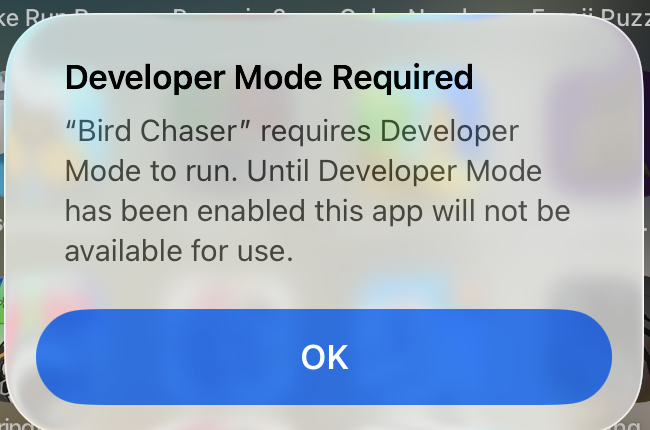
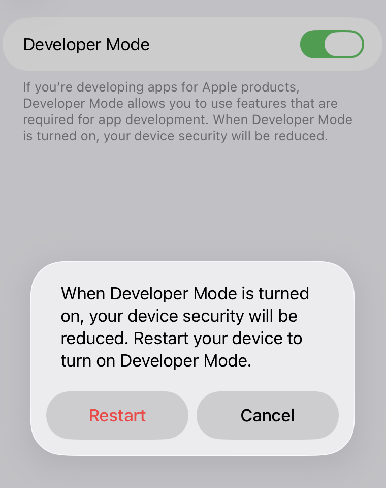
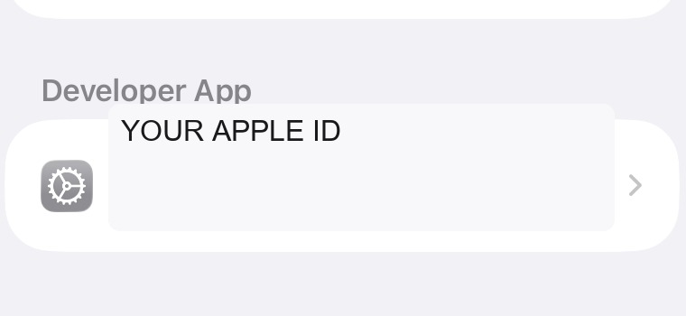
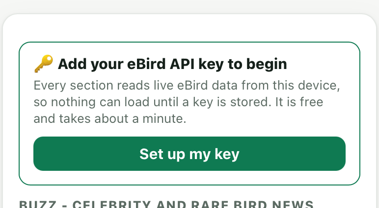
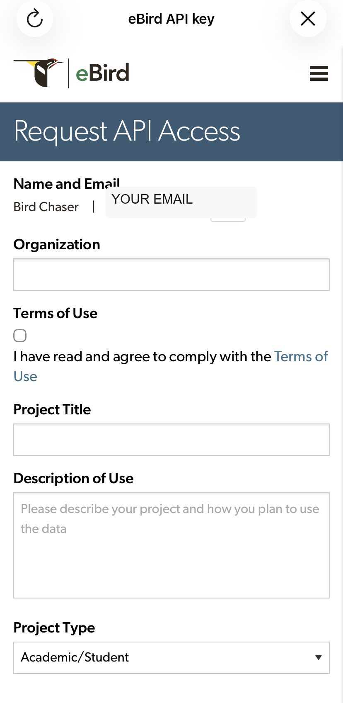

# Bird Chaser first-time setup

This guide covers the complete first run on an iPhone: installing the unsigned
app, allowing it to run, obtaining an eBird API key, and loading your own seen
list.

The screenshots are examples from an iPhone 11 running iOS 18. Apple may show
the trust and Developer Mode prompts in a different order. Personal account
details in these images have been replaced with placeholders.

## 1. Install the app with Sideloadly

1. Download `BirdChaser-unsigned.ipa` from the
   [latest GitHub Release](https://github.com/WyattHoutz/birding-app/releases).
2. Connect the iPhone to the computer and install the `.ipa` with
   [Sideloadly](https://sideloadly.io/).
3. Keep Sideloadly's automatic refresh enabled if you use a free Apple ID.
   Free-account signatures normally last seven days; each successful refresh
   starts a new seven-day period.

## 2. Enable Developer Mode if iOS asks

Opening Bird Chaser may first show **Developer Mode Required**:

Open **Settings → Privacy & Security → Developer Mode**, turn it on, and accept
the restart:

After the iPhone restarts, confirm **Turn On** when iOS asks again.

## 3. Trust the signing Apple ID if iOS asks

If iOS reports an **Untrusted Developer**:

1. Open **Settings → General → VPN & Device Management**.
2. Under **Developer App**, tap the Apple ID used by Sideloadly.

3. Tap **Trust**, then confirm.
4. Return to the Home Screen and open Bird Chaser again.

These are Apple security steps. Bird Chaser cannot display or bypass them
because the app is not allowed to run until they are complete.

## 4. Add an eBird API key

Bird Chaser reads eBird directly from the iPhone. It has no shared server key,
so each account needs its own free eBird API key.

On the Contents screen, tap **Set up my key**:

Tap **Get a key**. Bird Chaser opens eBird's **Request API Access** form:

1. Sign in to the eBird account you want this profile to use.
2. Complete the form accurately and accept eBird's Terms of Use.
3. Copy the key eBird issues.
4. Return to Bird Chaser.
5. Tap **Paste**, or paste the key into the field manually.
6. Tap **Test & save**.

Bird Chaser asks eBird to validate the key. A successful test stores it on this
device and returns to Contents. The app does **not** enforce an assumed key
length; eBird is the authority on whether a key is valid.

## 5. Set the account name

An eBird API key identifies an application, not the signed-in person's public
eBird profile. The API therefore cannot fill the display name from the key.

- After key setup, Contents shows a nonblocking **Add my name** prompt until a
  display name is stored.
- Importing `MyEBirdData.csv` fills the display/profile name when the export
  contains **First Name** and **Last Name**.
- Otherwise, enter the account's public eBird display name beside the API key
  in Settings.

The exact display name matters: Bird Chaser uses it to identify your own
checklists and your row on eBird leaderboards.

## 6. Import the account's seen list

A fresh profile starts with an **empty** seen list.

1. In eBird, request **Download My Data**.
2. Save `MyEBirdData.csv` to the iPhone.
3. In Bird Chaser, open **Settings → Seen list — eBird CSV**.
4. Tap **Import CSV…** and choose the file.

The import replaces any optional sample data for that profile. If this is a new
and genuinely empty eBird account, leave the seen list empty.

**Load sample data** is only for demonstrations. It loads the repository
owner's bundled snapshot and must not be used as the new account's personal
list.

## 7. Choose the report and home location

Bird Chaser currently starts on the **Washington (`US-WA`)** report because
that is the project's configured default; it is not inferred from the eBird
account.

In Settings:

1. Choose the appropriate **Default report**, or add a region/trip.
2. Set **Home location** if you want distance-ranked results.
3. Tap **Save**.

## 8. Confirm the setup

The Contents header should show the account display name and its own year count
when one is available. It must not show the bundled owner's count on a fresh
profile.

Open any live section. If it does not load, tap the footer version five times
to open the debug log and confirm:

- `apiKey` is present;
- `displayName` is the intended eBird public name;
- `profile` is the intended account profile;
- the seen-list source and imported row count match that account.

Never share the API key itself in screenshots or logs.

## Refresh before the seven-day signing period ends

With a free Apple ID, keep the computer running Sideloadly and place the iPhone
on the same Wi-Fi regularly. If automatic refresh does not complete before the
signature expires, reconnect the phone and install/refresh the same `.ipa`
again. The app's on-device settings and caches normally survive an in-place
refresh.
